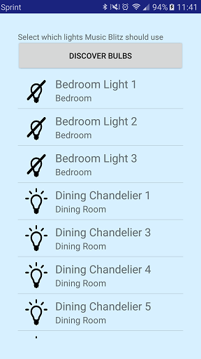

# Music Blitz
Music Blitz sees what music you play through your Spotify app and generates a light show in response. Rather than relying on noisy microphone input or at-the-moment audio, Music Blitz responds to the whole song and coordinates the light show in advance, giving a higher quality experience.

Music Blitz is available [on Google play](https://play.google.com/store/apps/details?id=com.saites.spotlight).

Major Features
 - Automatically create light shows in response to music played through Spotify
 - Precache playlists for offline light shows and faster response
 - Flash on the beat, according to frequency, or with major sounds in the music
 - Choose colors automatically or manually
 - Flash all lights together, one at a time, or via custom grouping

 
 

For troubleshooting, check out the [FAQ](faq.md). For information on settings, view the [settings documentation](settings.md).
